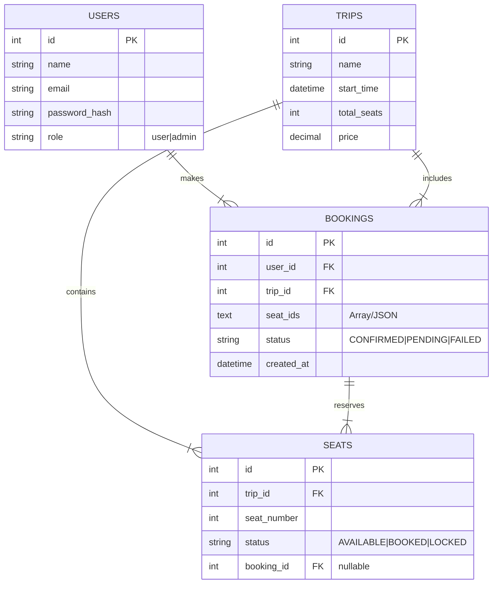

# System Design: Bus Ticket Booking System

## 1. High-Level Architecture

The system follows a typical **Client-Server Architecture** decoupled via a REST API.

```mermaid
graph TD
    UserClient[User (React SPA)] -->|HTTP Request| LB[Load Balancer]
    AdminClient[Admin (React SPA)] -->|HTTP Request| LB
    LB -->|Distribute| Server1[Node.js API Server 1]
    LB -->|Distribute| Server2[Node.js API Server 2]
    Server1 -->|Query| DB[(PostgreSQL Primary)]
    Server2 -->|Query| DB
    DB -.->|Replicate| DB_Replica[(PostgreSQL Read Replica)]
```

### Components
*   **Frontend**: React.js 19 with Vite, Tailwind CSS. Hosted on Vercel/Netlify.
*   **Backend**: Node.js + Express. Stateless REST API. Hosted on Render/Railway/AWS.
*   **Database**: PostgreSQL. ACID compliant relational database.
*   **Authentication**: JWT (JSON Web Tokens) for stateless authentication.

## 2. Database Design (ERD)



## 3. Concurrency Strategy (The Core Problem)

**Problem:** Two users (Alice and Bob) try to book Seat #5 on Trip #101 at the exact same millisecond. 
If we simply do:
1. `SELECT * FROM seats WHERE id=5` (Both see AVAILABLE)
2. `UPDATE seats SET status='BOOKED' WHERE id=5` (Both update successfully)
**Result:** Double Booking.

**Solution: Pessimistic Locking (Row-Level Locking)**
We establish a definitive "lock" on the resource (the seat rows) before reading/writing.

**Implementation Logic:**
1.  **Transaction Start:** `BEGIN`
2.  **Locking Read:** 
    ```sql
    SELECT * FROM seats 
    WHERE id IN ($1, $2) 
    FOR UPDATE;
    ```
    *   `FOR UPDATE` tells Postgres: "Lock these rows as if I'm about to update them. If anyone else tries to lock them, make them wait until I commit or rollback."
3.  **Validation:**
    *   If database returns rows, check `status`.
    *   If `status == 'BOOKED'`, ROLLBACK and return 409 Conflict.
4.  **Write:**
    *   `INSERT INTO bookings ...`
    *   `UPDATE seats SET status='BOOKED' ...`
5.  **Commit:** `COMMIT` releases the lock.

**Why this works?**
Postgres guarantees that only ONE transaction can hold the lock for a specific row at a time. The second transaction will wait. Once the first commits, the second acquires the lock, reads the *new* status (BOOKED), and fails validation.

## 4. Scalability Considerations

1.  **Database Scaling**:
    *   **Read Replicas**: For the "View Trips" and "View Seats" APIs (which are read-heavy), we can point them to Read Replicas, offloading the Primary DB.
    *   **Sharding**: If we grow to millions of trips, we can shard the database based on `trip_id` or `region` (e.g., separate DBs for North/South bus routes).

2.  **Caching**:
    *   **Redis**: We can cache the `GET /trips` and `GET /trips/:id` responses in Redis with a TTL (e.g., 30 seconds). 
    *   **Cache Invalidation**: On `createBooking`, we must invalidate the cache for that specific trip to ensure users see up-to-date seat availability.

3.  **Stateless Backend**:
    *   Since we use JWT and don't store session state in memory, we can horizontally scale the Node.js servers (spin up 10 instances behind a Load Balancer) without issues.
